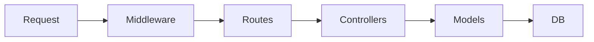

# rest-todo-express

This project is a TODO application implementing a RESTful API using Express.


## Tech stack

<div align=center>


</div>


## Installation

After cloning the project, run the following command to install the necessary packages:

```
npm install
```


## Running the Development Server

Use the following command to run the development server:

```
npm run dev
```

This command runs `src/app.ts` using `nodemon`. `nodemon` watches for file changes and automatically restarts the server.


## Running the Production Server

Use the following command to run the production server:

```
npm start
```

This command runs `src/app.ts`.


## Running Server on Docker

Build the image :

```bash
docker build -t express-app .
```

Run the image :

```bash
docker run -p 3000:3000 express-app
```


## Project Structure





## API Reference

### /api/v1/auth

#### /api/v1/auth/register

| Request Method | Request Headers                                              | Request Query | Request Body                                                 |
| -------------- | ------------------------------------------------------------ | ------------- | ------------------------------------------------------------ |
| POST           | `Content-Type: application/json`<br />`Accept: application/json` |               | {<br/>    "email":"abcd123456@gmail.com",<br/>    "password": "abcd123456"<br/>} |

| Response Status | Response Body                                          |      |
| --------------- | ------------------------------------------------------ | ---- |
| 201             | {<br/>    "message": "User created successfully"<br/>} |      |


| /register | `post` | register user |       | {email":"abcd12345@gmail.com",    "password":"abcd12345"} | 201: {"message": "User created successfully"} |
| --------- | ------ | ------------- | ----- | --------------------------------------------------------- | --------------------------------------------- |
| path      | method | description   | query | body                                                      | response                                      |
| /login    | `post` | login user    |       | {email":"abcd12345@gmail.com",    "password":"abcd12345"} | 200: {"token":"eyJhbGciO..."}                 |


### /api/v1/tasks

| path | method   | description               |
| ---- | -------- | ------------------------- |
| /    | `get`    | get tasks with pagination |
| /    | `post`   | create task               |
| /:id | `get`    | get a specific task       |
| /:id | `put`    | update the entire task    |
| /:id | `patch`  | update the task part      |
| /:id | `delete` | delete a task             |
